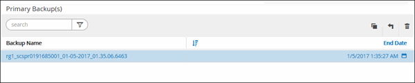

= Restaure e recupere um backup de recursos adicionado manualmente
:allow-uri-read: 
:icons: font
:imagesdir: ../media/

[role="lead"]
Você pode usar o SnapCenter para restaurar e recuperar dados de um ou mais backups.

.Antes de começar
* Você deve ter feito backup dos grupos de recursos ou recursos.
* Você deve ter cancelado qualquer operação de backup que esteja atualmente em andamento para o recurso ou grupo de recursos que deseja restaurar.
* Para comandos pré-restauração, pós restauração, montagem e desmontagem, você deve verificar se os comandos existem na lista de comandos disponível no host do plug-in a partir dos seguintes caminhos:
+
Para o Windows: _C: Arquivos de programas/NetApp/SnapCenter/SnapCenter Plug-in Creator/etc/allowed_commands_list.txt_

+
Para Linux: _/var/opt/SnapCenter/scc/allowed_commands_list.txt_

+

NOTE: Se os comandos não existirem na lista de comandos, a operação falhará.

.Sobre esta tarefa
* As cópias de backup baseadas em arquivo não podem ser restauradas a partir do SnapCenter.
* Após a atualização para o SnapCenter 4,3, os backups feitos no SnapCenter 4,2 podem ser restaurados, mas não podem ser recuperados. Você precisa usar scripts de recuperação HANA ou estúdio externos ao SnapCenter para recuperar os backups feitos no SnapCenter 4,2.
* Para a versão ONTAP 9.12,1 e inferior, os clones criados a partir dos instantâneos do Vault do SnapLock como parte da restauração herdarão o tempo de expiração do SnapLock Vault. O administrador do storage deve limpar manualmente os clones após o tempo de expiração do SnapLock.

.Passos
. No painel de navegação esquerdo, clique em *Resources* e selecione o plug-in apropriado na lista.
. Na página recursos, filtre recursos da lista suspensa *Exibir* com base no tipo de recurso.
+
Os recursos são exibidos juntamente com o tipo, host, grupos de recursos e políticas associados e status.

+

NOTE: Embora um backup possa ser para um grupo de recursos, ao restaurar, você deve selecionar os recursos individuais que deseja restaurar.

+
Se o recurso não estiver protegido, ""não protegido"" é exibido na coluna Estado geral. Isso pode significar que o recurso não está protegido ou que o recurso foi protegido por um usuário diferente.

. Selecione o recurso ou selecione um grupo de recursos e, em seguida, selecione um recurso nesse grupo.
+
A página de topologia do recurso é exibida.

. Na exibição Gerenciar cópias, selecione *backups* nos sistemas de armazenamento primário ou secundário (espelhado ou abobadado).
. Na tabela de backup principal, selecione o backup do qual você deseja restaurar e clique em * *image:../media/restore_icon.gif["ícone de restauro"].
+

. Na página Restaurar escopo, selecione *recurso completo* ou *nível de arquivo*.
+
.. Se você selecionar *Complete Resource*, todos os volumes de dados configurados do banco de dados SAP HANA serão restaurados.
+
Se o recurso contiver volumes ou qtrees, os instantâneos obtidos após o instantâneo selecionado para restauração nesses volumes ou qtrees serão excluídos e não poderão ser recuperados. Além disso, se qualquer outro recurso estiver hospedado nos mesmos volumes ou qtrees, esse recurso também será excluído.

.. Se você selecionar *File Level*, poderá selecionar *All* ou selecionar os volumes ou qtrees específicos e, em seguida, inserir o caminho relacionado a esses volumes ou qtrees, separados por vírgulas
+
*** Você pode selecionar vários volumes e qtrees.
*** Se o tipo de recurso for LUN, todo o LUN será restaurado.
+
Pode selecionar vários LUNs.

+

NOTE: Se você selecionar *All*, todos os arquivos nos volumes, qtrees ou LUNs serão restaurados.

. Na página operações anteriores, insira pré-restauração e desmonte comandos para serem executados antes de executar um trabalho de restauração.
+
Os comandos de desmontagem não estão disponíveis para recursos descobertos automaticamente.

. Na página Post OPS, insira os comandos mount e POST Restore para serem executados após a execução de um trabalho de restauração.
+
Os comandos de montagem não estão disponíveis para recursos descobertos automaticamente.

+

NOTE: Para os comandos pre e POST para operações quiesce, Snapshot e unquiesce, você deve verificar se os comandos existem na lista de comandos disponível no host plug-in a partir do caminho _/opt/SnapCenter/snapenter/scc/allowed_commands.config_ para Linux e _C: Arquivos de programas/NetApp/SnapCenter/SnapCenter Plug-in Creator/allowed_Commands_list.txt.

. Na página notificação, na lista suspensa *preferência de e-mail*, selecione os cenários nos quais você deseja enviar os e-mails.
+
Você também deve especificar os endereços de e-mail do remetente e do destinatário e o assunto do e-mail. O SMTP também deve ser configurado na página *Configurações* > *Configurações globais*.

. Revise o resumo e clique em *Finish*.
. Monitorize o progresso da operação clicando em *Monitor* > *trabalhos*.

