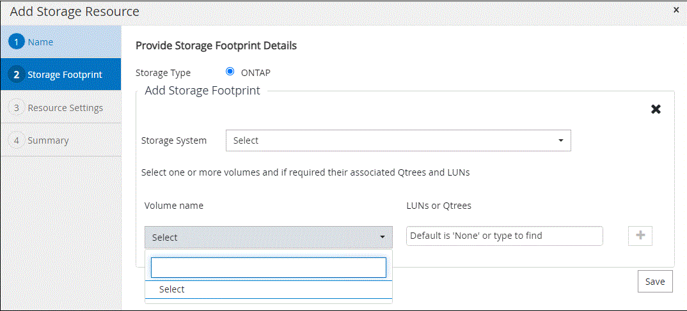

= Adicione recursos aos plug-ins personalizados do SnapCenter
:allow-uri-read: 
:icons: font
:imagesdir: ../media/

[role="lead"]
Você deve adicionar os recursos que deseja fazer backup ou clonar. Dependendo do seu ambiente, os recursos podem ser instâncias de banco de dados ou coleções que você deseja fazer backup ou clonar.

.Antes de começar
* Você deve ter concluído tarefas como instalar o servidor SnapCenter, adicionar hosts, criar conexões do sistema de storage e adicionar credenciais.
* Você deve ter link:concept_develop_a_plug_in_for_your_application.html["criou um plug-in personalizado para a sua aplicação"].
* Você deve ter carregado os plug-ins para o servidor SnapCenter.

.Sobre esta tarefa
Você também pode adicionar recursos para aplicativos MySQL e DB2. Esses plug-ins podem ser baixados do https://automationstore.netapp.com/home.shtml["Repositório de automação do storage da NetApp"].

.Passos
. No painel de navegação esquerdo, selecione *Resources* e, em seguida, selecione o plug-in apropriado na lista.
. Na página recursos, selecione *Adicionar recurso*.
. Na página fornecer detalhes do recurso, execute as seguintes ações:
+
|===
| Para este campo... | Faça isso... 

 a| 
Nome
 a| 
Introduza o nome do recurso.

 a| 
Nome do host
 a| 
Selecione o host.

 a| 
Tipo
 a| 
Selecione o tipo. Tipo é definido pelo usuário de acordo com o arquivo de descrição do plug-in. Por exemplo, banco de dados e instância.

Caso o tipo selecionado tenha um pai, insira os detalhes do pai. Por exemplo, se o tipo for Banco de dados e o pai for Instância, insira os detalhes da Instância.

 a| 
Nome da credencial
 a| 
Selecione credencial ou crie uma nova credencial.

 a| 
Monte caminhos
 a| 
Introduza os caminhos de montagem onde o recurso está montado. Isso é aplicável apenas para um host Windows.

|===
. Na página fornecer espaço físico de armazenamento, selecione um sistema de armazenamento e escolha um ou mais volumes, LUNs e qtrees e, em seguida, selecione *Salvar*.
+
Opcional: Selecione o image:../media/add_policy_from_resourcegroup.gif["Ícone Plus"] ícone para adicionar mais volumes, LUNs e qtrees de outros sistemas de armazenamento.

+

NOTE: Os plug-ins personalizados do SnapCenter não oferecem suporte à descoberta automática dos recursos. Os detalhes de armazenamento de ambientes físicos e virtuais também não são descobertos automaticamente. Você precisa fornecer as informações de storage para ambientes físicos e virtuais ao criar os recursos.

+

. Na página Configurações de recursos, forneça pares de valor de chave personalizados para o recurso.
+
Use os pares de chave-valor personalizados se você quiser passar informações específicas de recursos. Por exemplo, quando você está usando o plug-in MySQL, você deve especificar um HOST como HOST, PORT

+

NOTE: Certifique-se de que as palavras HOST e PORT estão em maiúsculas.

+
image::../media/resource_settings.gif[definições de recursos]

. Revise o resumo e selecione *Finish*.

.Resultado
Os recursos são exibidos juntamente com informações como tipo, nome do host ou cluster, grupos e políticas de recursos associados e status geral.

IMPORTANT: Você deve atualizar os recursos se os bancos de dados forem renomeados fora do SnapCenter.

.Depois de terminar
Se você quiser fornecer acesso aos ativos a outros usuários, o administrador do SnapCenter deve atribuir ativos a esses usuários. Isso permite que os usuários executem as ações para as quais eles têm permissões nos ativos que são atribuídos a eles.

Depois de adicionar os recursos, você pode modificar os detalhes do recurso. Se um recurso de plug-in personalizado tiver backups associados a ele, os seguintes campos não poderão ser modificados: Nome do recurso, tipo de recurso e nome do host.
